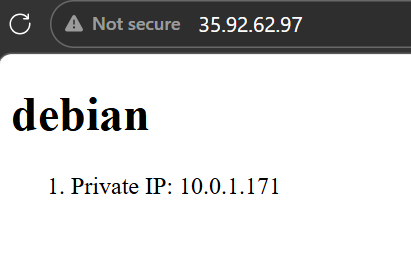

# 4640-ansible-roles-lab
### Setup
1. Clone the repository
    
    ```bash
    git clone https://gitlab.com/cit_4640/4640-ansible-roles-lab.git
    ```
    
2. Create an ssh key
    
    ```bash
    ssh-keygen -t ed25519 -f ~/.ssh/aws
    ```
    
3. Run script to add the SSH key to AWS
    
    ```bash
    sudo chmod +x /scripts/import_lab_key
    ./scripts/import_lab_key ~/.ssh/aws
    ```
    
4. Run Terraform commands in the terraform directory to create the two servers
    
    ```bash
    cd terraform
    terraform init 
    terraform fmt
    terraform validate 
    terraform plan 
    terraform apply
    ```
    

### Create the Roles
1. Create a new playbook
    
    ```bash
    cd ansible 
    nano playbook.yml
    ```
    
2. Refactor the configuration in "plays.yml" into the "playbook.yml" file
    
    ```bash
    - name: Setup Redis and Frontend Servers
      hosts:
        - server_role_redis_server
        - server_role_frontend_server
      become: true
      gather_facts: yes # Collect facts only once for the entire play
    
      vars:
        # Set remote_user conditionally for each server role
        ansible_user: "{{ 'rocky' if 'server_role_redis_server' in group_names else 'admin' }}"
    
      roles:
        - role: redis
          when: "'server_role_redis_server' in group_names"
        - role: frontend
          when: "'server_role_frontend_server' in group_names" 		
    	  
    ```
    
3. Create the `redis` role
    
    ```bash
    # initialize the role 
    ansible-galaxy role init roles/redis
    ```
    
4. Edit the `roles/redis/tasks/main.yml` file for the `redis`
    
    ```bash
    ---
    - name: Install redis on Rocky Linux
      ansible.builtin.dnf:
        name: redis
        state: present
    ```
    
5. Create the `frontend` role
    
    ```bash
    # initialize the role 
    ansible-galaxy role init roles/frontend
    ```
    
6. Move the files into the `roles/frontend/files` folder and templates into the `roles/frontend/templates` folder
7. Edit the `roles/frontend/tasks/main.yml` file for the `frontend`
    
    ```bash
    ---
    - name: Install nginx on Debian
      ansible.builtin.apt:
        name: nginx
        state: present
        update_cache: yes
    # Create index.html using a template
    - name: create index.html
      ansible.builtin.template:
        src: index.html.j2 # Ensure you have the file "index.html.j2" in your templates directory
        dest: /var/www/html/index.html
    # Create nginx configuration file
    - name: create nginx configuration
      ansible.builtin.copy:
        src: default.conf # Ensure you have the file "default.conf" in your files directory
        dest: /etc/nginx/sites-available/default
      notify: reload nginx
    # Enable nginx configuration by creating a symlink
    - name: enable nginx configuration
      ansible.builtin.file:
        src: /etc/nginx/sites-available/default
        dest: /etc/nginx/sites-enabled/default
        state: link
    ```
    
8. Create the handler by editing `roles/frontend/handlers/main.yml`
    
    ```bash
    ---
    - name: reload nginx
      ansible.builtin.service:
        name: nginx
        state: reloaded
    ```
    
9. Run the ansible configuration
    
    ```bash
    ansible-playbook -i inventory/aws_ec2.yml playbook.yml
    ```

